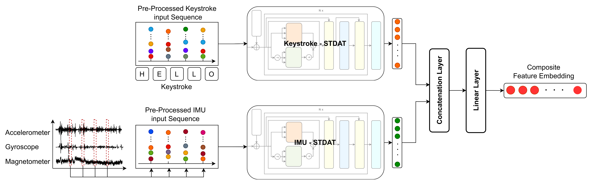
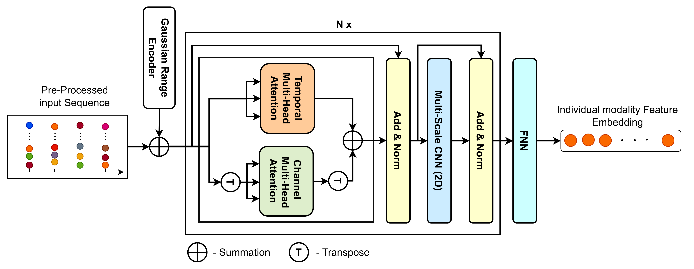

# BehaveFormer: A Framework with Spatio-Temporal Dual Attention Transformers for IMU enhanced Keystroke Dynamics
## Accepted at IJCB 2023: [Arxiv](https://arxiv.org/abs/2307.11000)

## Abstract
Continuous Authentication using behavioural biometrics is a type of biometric identification that recognizes individuals based on their unique behavioural characteristics, like their typing style. However, the existing systems that use keystroke or touch stroke data have limited accuracy and reliability. To improve this, smartphones' Inertial Measurement Unit sensors, which include accelerometers, gyroscopes, and magnetometers, can be used to gather data on users' behavioural patterns, such as how they hold their phones. Combining this IMU data with keystroke data can enhance the accuracy of behavioural biometrics-based CA. This paper [1] proposes BehaveFormer (See Fig. 01), a new framework that employs keystroke and IMU data to create a reliable and accurate behavioural biometric CA system. It includes two Spatio-Temporal Dual Attention Transformer (STDAT) (See Fig. 02), a novel transformer we introduce to extract more discriminative features from keystroke dynamics. Experimental results on three publicly available datasets (Aalto DB, HMOG DB, and HuMIdb) demonstrate that BehaveFormer outperforms the state-of-the-art behavioural biometric-based CA systems. For instance, on the HuMIdb dataset, BehaveFormer achieved an EER of 2.95\%. Additionally, the proposed STDAT has been shown to improve the BehaveFormer system even when only keystroke data is used. For example, on the Aalto DB dataset, BehaveFormer achieved an EER of 1.80\%. These results demonstrate the effectiveness of the proposed STDAT and the incorporation of IMU data for behavioural biometric authentication.

*Fig. 01: BehaveFormer Model Diagram*


*Fig. 02: Spatio-Temporal Dual Attention Transformer (STDAT) Diagram*


## Datasets
|    Dataset   | Subjects | Sessions | Actions                                          | Modalities                                                                             | Download                                                                                                                                                                                           |
|:------------:|:--------:|:--------:|--------------------------------------------------|----------------------------------------------------------------------------------------|----------------------------------------------------------------------------------------------------------------------------------------------------------------------------------------------------|
| Aalto DB [2] | ~260 000 |    15    | Typing                                           | Keystroke                                                                              | <a href="https://userinterfaces.aalto.fi/typing37k/" style="padding: 10px 20px; background-color: #4CAF50; color: white; text-decoration: none; border-radius: 4px; cursor: pointer;">Aalto DB</a> |
|  HMOG DB [3] |    100   |    24    | Reading, Typing, Map navigation                  | Keystroke, Raw touch event, IMU                                                        | <a href="https://hmog-dataset.github.io/hmog/" style="padding: 10px 20px; background-color: #4CAF50; color: white; text-decoration: none; border-radius: 4px; cursor: pointer;">HMOG DB</a>        |
|  Humidb [4]  |    599   |    1-5   | Typing, Swipe, Tap, Hand gesture, Finger writing | Keystroke, Touch, IMU, Light, GPS, WiFi, Bluetooth, Orientation, Proximity, Microphone | <a href="https://github.com/BiDAlab/HuMIdb" style="padding: 10px 20px; background-color: #4CAF50; color: white; text-decoration: none; border-radius: 4px; cursor: pointer;">Humidb</a>            |

## Preprocessing and Feature Creation

Before training, preprocessed and feature extracted data files (training, validation, testing) must be created.

- Setting up configs

To begin the preprocessing process, configure the settings in the `config.json` file. Configure below fields before generating data files for the relevant dataset.

    AaltoDB preprocessing :-
        data → aalto → {dataset_url}
  
    HMOGDB preprocessing :-
        data → {keystroke_sequence_len, imu_sequence_len}
        data → hmog → {dataset_url, windowing_offset}

    HuMIdb preprocessing :-
        data → {keystroke_sequence_len, imu_sequence_len}
        data → hmog → {dataset_url, username, password, windowing_offset}

- Preprocessing

To begin, create a zip file containing the code base and copy it into your notebook. Next, unzip the file using the command `!unzip BehaveFormer.zip`. Next, install the necessary packages mentioned in the requirements.txt file by running the command `!pip install -r BehaveFormer/requirements.txt`. Finally, mount your Google Drive to the notebook as the output files will be saved to Google Drive.

For preprocessing, consider the following commands :

|    Dataset    |                  Run Command                       |        Output Folder        |
|:-------------:|:--------------------------------------------------:|:---------------------------:|
|    AaltoDB    | `!python BehaveFormer/run.py --mode preprocess --dataset aalto` | drive/MyDrive/              |
|    HMOGDB     | `!python BehaveFormer/run.py --mode preprocess --dataset hmog`  | drive/MyDrive/HMOG_Dataset/ |
|    HuMIdb     | `!python BehaveFormer/run.py --mode preprocess --dataset humi`  | drive/MyDrive/HuMI_Dataset/ |

## Training
- Setting up configs

To begin the training process, configure the settings in the `config.json` file. Within this file, specify the Google Drive share IDs for the train, test, and validation files of each dataset. These file ids can be filled under `preprocessed_data → dataset → {train, test, val}`.

- Training

To begin, create a zip file containing the code base and copy it into your notebook. Next, unzip the file using the command `!unzip BehaveFormer.zip`. Finally, install the necessary packages mentioned in the requirements.txt file by running the command `!pip install -r BehaveFormer/requirements.txt`.

For traing consider the following commands :
|       Experiment       |                     Type                    |                                                Run Command                                               |
|:----------------------:|:-------------------------------------------:|:--------------------------------------------------------------------------------------------------------:|
| Keystroke              | Keystroke                                   | `!python BehaveFormer/run.py --model keystroke --mode train --dataset hmog --epochs epoch_count`                          |
| Keystroke_IMU combined | Keystroke + Accelerometer                   | `!python BehaveFormer/run.py --model keystroke_imu --mode train --dataset hmog --imu acc --epochs epoch_count`     |
| Keystroke_IMU combined | Keystroke + Gyroscope                       | `!python BehaveFormer/run.py --model keystroke_imu --mode train --dataset hmog --imu gyr --epochs epoch_count`     |
| Keystroke_IMU combined | Keystroke + Magnetometer                    | `!python BehaveFormer/run.py --model keystroke_imu --mode train --dataset hmog --imu mag --epochs epoch_count`     |
| Keystroke_IMU combined | Keystroke + Acc. + Gyroscope                | `!python BehaveFormer/run.py --model keystroke_imu --mode train --dataset hmog --imu acc_gyr --epochs epoch_count` |
| Keystroke_IMU combined | Keystroke + Acc. + Magnetometer             | `!python BehaveFormer/run.py --model keystroke_imu --mode train --dataset hmog --imu acc_mag --epochs epoch_count` |
| Keystroke_IMU combined | Keystroke + Magnetometer + Gyroscope        | `!python BehaveFormer/run.py --model keystroke_imu --mode train --dataset hmog --imu mag_gyr --epochs epoch_count` |
| Keystroke_IMU combined | Keystroke + Acc. + Gyroscope + Magnetometer | `!python BehaveFormer/run.py --model keystroke_imu --mode train --dataset hmog --imu all --epochs epoch_count`     |
| Transfer Learning      | Keystroke                                   | Initial train - `!python BehaveFormer/run.py --model tl --mode train --dataset aalto --epochs epoch_count` , Tuning - `!python BehaveFormer/run.py --model tl --mode continue_train --dataset hmog --initepoch last_trained_epoch --epochs epoch_count`                  |

To run the commands for keystroke or keystroke_IMU combined scenarios with AaltoDB or HuMIdb, replace `hmog` with the respective dataset name. Additionally, replace `epoch_count` with the desired number of epochs. For example, to train using AaltoDB for 200 epochs, use the following command: `!python BehaveFormer/run.py --model keystroke --mode train --dataset aalto --epochs 200`. Similarly, for HuMIdb with 300 epochs, use: `!python BehaveFormer/run.py --model keystroke --mode train --dataset humi --epochs 300`.

- Folder Structure

During the training process, two folders are created in the directory of the train.py script: `best_models` and `checkpoints`.

The `best_models` folder is used to store models that exhibit improved Equal Error Rate (EER) compared to the previous epoch. These models are saved as `.pt` files, with the file name indicating the epoch number and the improved EER.

On the other hand, the `checkpoints` folder is used to save checkpoints at regular intervals, specifically after every 50 epochs. These checkpoints are stored as `.tar` files, with the file name denoting the epoch number.

- Training Continue

If you are unable to complete the full epoch count in one attempt or wish to train for additional epochs, you can utilize the training continue feature. To do so, update the previous run commands as shown below:

To continue training the Keystroke model for HMOGDB:
```
!python BehaveFormer/run.py --model keystroke --mode continue_train --dataset hmog --initepoch last_trained_epoch --epochs epoch_count 
```
Replace "epoch_count" with the total number of epochs you want to train, and "last_trained_epoch" with the epoch number you last trained up to. 

For example:
```
!python BehaveFormer/run.py --model keystroke --mode continue_train --dataset hmog --initepoch 50 --epochs 100
```
This command will continue the training process for 100 epochs, starting from the 51st epoch.

## Evaluation

After training the models, the instances of the best models are saved into the `best_models` directory within each model script directory. You can utilize these instances to evaluate the trained models, as indicated in the following command,

```
!python BehaveFormer/run.py --model keystroke --mode test --dataset aalto --metric basic --testfile epoch_9_eer_15.428571428571416.pt 
```

You can replace `--model`, `--dataset`, and add `--imu` parameters to test all different models indicated in training section. `--testfile` parameter can be updated with any model instance name stored in `best_models` directory. 

There are thress types of metrics you can calculate through this evaluation process. Therefore, you can specify three different values for `--metric` paramter as indicated in the following description.

- `basic` - EER (Equal Error Rate), Usability, TCR (Time to Correct Reject), FRWI (Flase Reject Worse Interval), and FAWI (False Accept Worse Interval) can be calculated using this keyword.
- `det` - The required data to draw the det curve, is calulated using this keyword.
- `pca` - t-SNE curve is generated for 10 different randomly selected test users. Additionally, silhouette score is generated providing the goodness of the clustering.

During the evaluation process, one folder is created in the directory of the `test.py` script: `results`.

Inside the result directory, `basic.csv`, `far-frr.csv`, `pca-graph.png`, and `silhouette_score.csv` are generated based on the provided `--metric` keyword.

## Experiments Weights

The model weights of our experiments is included in <a href="https://drive.google.com/drive/folders/1NMj8AYgD9dn4_x1-6eq-EAfQI0hDER_w?usp=sharing" style="padding: 5px 8px; background-color: #4CAF50; color: white; text-decoration: none; border-radius: 4px; cursor: pointer;">this drive folder</a>.

- Folder Structure - The folder structure is similar to the structure of experiments folder in this source code. A folder that correspons to an experiment belonging to a particular dataset contains the model weights file.

## Citation ##
If you use any of the code provided in this repository or the models provided, please cite the following paper:
```
@InProceedings{Senerath_2023_IJCB,
    author    = {D. Senerath, S. Tharinda, M. Vishwajith, S. Rasnayaka, S. Wickramanayake, and D. Meedeniya},
    title     = {BehaveFormer: A Framework with Spatio-Temporal Dual Attention Transformers for IMU enhanced Keystroke Dynamics},
    booktitle = {{IEEE} International Joint Conference on Biometrics, {IJCB} 2023},
    month     = {September},
    year      = {2023}
}
```

## References
[1] - D. Senarath, S. Tharinda, M. Vishvajith, S. Rasnayaka, S. Wickramanayake and D. Meedeniya, "Re-evaluating Keystroke Dynamics for Continuous Authentication," 2023 3rd International Conference on Advanced Research in Computing (ICARC), Belihuloya, Sri Lanka, 2023, pp. 202-207, doi: 10.1109/ICARC57651.2023.10145743.

[2] - K. Palin, A. M. Feit, S. Kim, P. O. Kristensson, and A. Oulasvirta. How do people type on mobile devices? observations from a study with 37,000 volunteers. In Proceedings of the 21st International Conference on Human-Computer Interaction with Mobile Devices and Services, pages 1–12, Taipei, Taiwan, 2019.

[3] - Z. Sitov ́a, J. ˇSedˇenka, Q. Yang, G. Peng, G. Zhou, P. Gasti, and K. S. Balagani. Hmog: New behavioral biometric features for continuous authentication of smartphone users. IEEE Transactions on Information Forensics and Security, 11(5):877–892, 2016.

[4] - A. Acien, A. Morales, J. Fierrez, R. Vera-Rodriguez, and O. Delgado-Mohatar. Becaptcha: Behavioral bot detection using touchscreen and mobile sensors benchmarked on humidb. Engineering Applications of Artificial Intelligence, 98:104058, 2021.
